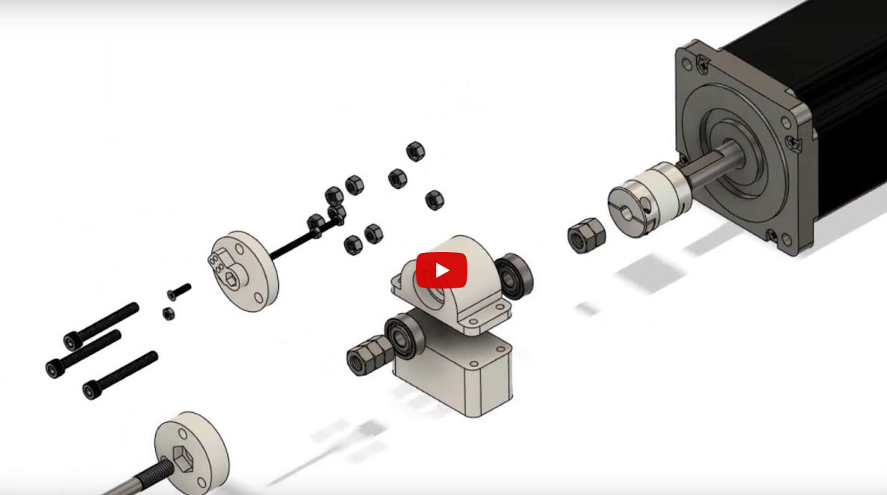

# SpringMachine 

Open Source проект малого напівавтоматичного верстата для намотування пружин.

## Список компонентів

...

## 3D моделі

В папці 3dModels розміщено `.stl` файли для друку. В папці `3dModels/StepFiles` ви знайдете файли для CAD систем, які можна редагувати. 

Для перегляду вибух-схеми натисніть на зображення:

## Схема підключення

* Підключення мотора до драйвера `Білий` -> `B-`, `Зелений` -> `B+`, `Чорний` -> `A+`, `Синій` -> `A-`

* Підключення мотора(енкодера) до драйвера `Білий` -> `EGND`, `Червоний` -> `VCC`, `Коричневий` -> `EA-`, `Чорний` -> `EA+`, `Зелений` -> `EB-`, `Жовтий` -> `EB+`

**Налаштування дільників драйвера:**
| 1 | 2 | 3 | 4 | 5 | 6 |
|---|---|---|---|---|---|
| 0 | 1 | 0 | 0 | 0 | 1 |
